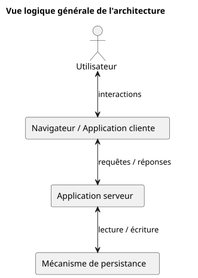
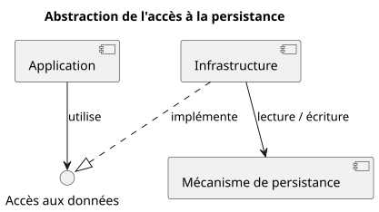
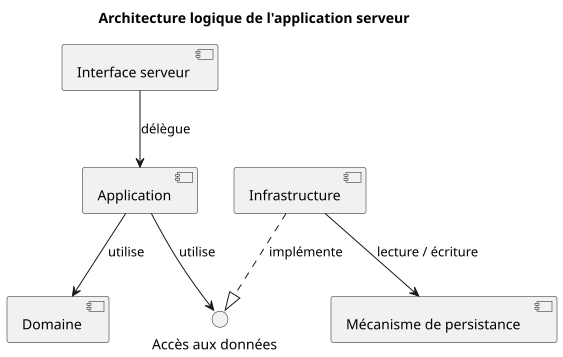
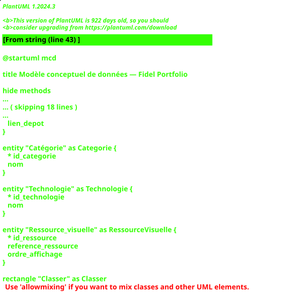
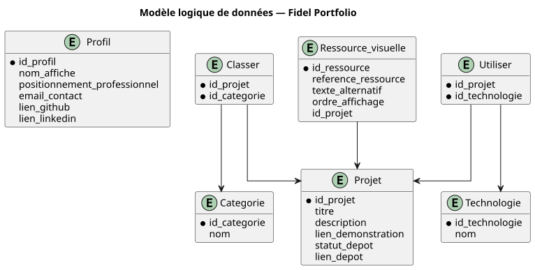
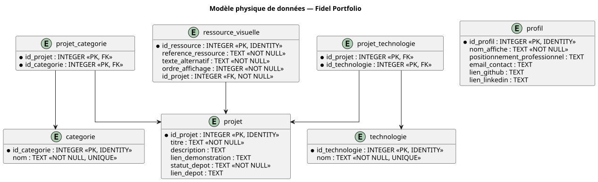

# Architecture

| Élément | Valeur |
|---------|--------|
| Projet | Fidel Portfolio |
| Document | Architecture |
| Version | 1.0 |
| Auteur | Fidel Nziengui Ateba |
| Statut | À valider |
| Dernière mise à jour | 26/08/2026 |

---

← [Spécifications techniques](04-specifications-techniques.md) | [Sécurité →](06-securite.md)

## Sommaire

1. [Introduction](#1-introduction)
2. [Contexte et objectifs architecturaux](#2-contexte-et-objectifs-architecturaux)
3. [Vue d'ensemble de l'architecture](#3-vue-densemble-de-larchitecture)
4. [Architecture applicative](#4-architecture-applicative)
5. [Architecture du client](#5-architecture-du-client)
6. [Architecture du serveur](#6-architecture-du-serveur)
7. [Architecture des données](#7-architecture-des-données)
8. [Communication entre les composants](#8-communication-entre-les-composants)
9. [Architecture de l'authentification et des autorisations](#9-architecture-de-lauthentification-et-des-autorisations)
10. [Déploiement et infrastructure](#10-déploiement-et-infrastructure)
11. [Décisions architecturales](#11-décisions-architecturales)
12. [Évolutivité de l'architecture](#12-évolutivité-de-larchitecture)
13. [Documents liés](#13-documents-liés)

---

## 1. Introduction

### 1.1 Objet du document

Ce document décrit l'architecture retenue pour la version 1 de **Fidel Portfolio**.

Il traduit les exigences et décisions établies dans les spécifications techniques en une organisation structurée des différents composants du système, de leurs responsabilités, de leurs interactions et de leurs dépendances.

Il constitue la référence architecturale pour la conception, l'implémentation, le déploiement et les évolutions de l'application.

### 1.2 Objectifs

Ce document a pour objectifs de :

- présenter l'architecture globale de l'application ;
- définir les principaux composants du système et leurs responsabilités ;
- préciser les relations et les flux entre ces composants ;
- définir l'organisation interne des différentes parties de l'application ;
- décrire l'organisation et la persistance des données ;
- préciser les principes architecturaux liés à l'authentification et aux autorisations ;
- documenter les principales décisions architecturales et leur justification ;
- fournir les vues et diagrammes nécessaires à la compréhension de l'architecture ;
- préparer l'implémentation tout en conservant la traçabilité avec les spécifications techniques.

### 1.3 Périmètre

Le présent document couvre l'architecture de la version 1 de **Fidel Portfolio**.

Il décrit notamment :

- l'architecture globale du système ;
- l'organisation du client et du serveur ;
- le découpage des responsabilités applicatives ;
- les mécanismes de communication entre les composants ;
- l'organisation et la persistance des données ;
- l'intégration de l'authentification et des autorisations ;
- les principes de déploiement nécessaires à la compréhension de l'architecture ;
- les principales décisions architecturales.

Les règles de sécurité détaillées, la stratégie de test et les procédures opérationnelles sont documentées dans les documents dédiés correspondants.

---

## 2. Contexte et objectifs architecturaux

### 2.1 Contexte architectural

La version 1 de **Fidel Portfolio** ne constitue pas uniquement un site de présentation statique.

L'application doit permettre la consultation publique du profil et des projets, mais également la gestion dynamique des projets depuis un espace d'administration authentifié.

Les données relatives aux projets doivent être persistées afin de permettre leur création, leur consultation, leur modification et leur suppression sans nécessiter de modification directe du code source de l'application.

L'architecture doit ainsi prendre en charge plusieurs catégories de responsabilités :

- la présentation et les interactions avec l'utilisateur ;
- l'exposition des fonctionnalités publiques du portfolio ;
- l'authentification et le contrôle des accès aux fonctionnalités d'administration ;
- l'exécution de la logique applicative et des règles métier ;
- la gestion et la persistance des données ;
- la communication entre les différentes parties du système.

L'application est destinée à évoluer progressivement. L'architecture retenue doit donc permettre l'ajout ou la modification de fonctionnalités sans nécessiter une remise en cause globale de son organisation.

### 2.2 Objectifs architecturaux

L'architecture de **Fidel Portfolio** doit répondre aux objectifs suivants :

- assurer une séparation claire des responsabilités entre les différentes parties du système ;
- isoler l'interface utilisateur de la logique applicative et de l'accès aux données ;
- centraliser côté serveur les traitements nécessitant un contrôle applicatif ;
- empêcher l'accès direct du client aux mécanismes internes de persistance ;
- permettre la gestion dynamique et persistante des projets ;
- permettre l'intégration d'un mécanisme d'authentification et d'autorisation pour l'administration ;
- favoriser la modularité et limiter le couplage entre les composants ;
- faciliter les tests, la maintenance et les évolutions futures ;
- conserver une complexité architecturale proportionnée aux besoins et à l'échelle de la V1 ;
- permettre un déploiement reproductible et compatible avec les contraintes définies dans les spécifications techniques.

### 2.3 Principes architecturaux

La conception de l'application repose sur les principes suivants :

#### Séparation des responsabilités

Chaque partie du système doit disposer de responsabilités clairement identifiées.

La présentation, la logique applicative, les règles métier et l'accès aux données ne doivent pas être confondus dans un même ensemble de responsabilités.

#### Faible couplage

Les composants doivent limiter leurs dépendances directes afin qu'une modification localisée entraîne le moins possible de répercussions sur le reste du système.

#### Cohésion

Les éléments répondant à une même responsabilité fonctionnelle ou technique doivent être regroupés de manière cohérente.

#### Encapsulation des données

Le client ne doit pas accéder directement au système de persistance.

Les opérations sur les données doivent transiter par les mécanismes exposés par le serveur, qui applique les contrôles et traitements nécessaires avant toute interaction avec la persistance.

#### Contrôle côté serveur

Les contrôles réalisés dans l'interface cliente peuvent améliorer l'expérience utilisateur, mais ils ne constituent pas une garantie suffisante.

Les règles nécessitant une garantie applicative, notamment la validation des données, l'authentification, les autorisations et les règles métier, doivent être appliquées côté serveur.

#### Simplicité proportionnée au besoin

L'architecture doit répondre aux besoins identifiés sans introduire de complexité distribuée ou opérationnelle qui ne serait pas justifiée par la V1.

Elle doit néanmoins conserver une organisation permettant son évolution si les besoins futurs le nécessitent.

---

## 3. Vue d'ensemble de l'architecture

### 3.1 Architecture retenue

La V1 de **Fidel Portfolio** repose sur une architecture client-serveur avec une organisation applicative modulaire.

Cette architecture sépare les responsabilités principales du système entre :

- une application cliente, exécutée dans le navigateur et chargée de l'interface utilisateur ;
- une application serveur, chargée des traitements applicatifs, des règles métier, de l'authentification, des autorisations et de l'accès aux données ;
- un mécanisme de persistance, chargé de conserver durablement les données nécessaires au fonctionnement de l'application.

L'application cliente communique avec l'application serveur au travers d'une interface de communication définie.

L'application cliente n'accède pas directement au système de persistance. Toute opération nécessitant l'accès aux données persistantes transite par l'application serveur.

### 3.2 Vue logique générale

La vue suivante représente les principaux blocs logiques de l'architecture ainsi que leurs relations.

  

  <em>Figure 1 — Vue logique générale de l'architecture de Fidel Portfolio.</em>

Cette représentation constitue une vue logique du système. Elle présente les principaux blocs de l'architecture et leurs relations sans représenter leur organisation interne ni leur déploiement physique.

L'organisation interne de l'application cliente et de l'application serveur est détaillée respectivement aux [§ 5 — Architecture du client](#5-architecture-du-client) et [§ 6 — Architecture du serveur](#6-architecture-du-serveur).

Les modalités de communication entre le client et le serveur sont détaillées au [§ 8 — Communication entre les composants](#8-communication-entre-les-composants).

---

## 4. Architecture applicative

### 4.1 Organisation générale

L'architecture applicative de **Fidel Portfolio** repose sur une organisation modulaire visant à séparer les différentes responsabilités du système.

Cette organisation doit permettre de faire évoluer une partie de l'application en limitant les impacts sur les autres parties et de conserver une distinction claire entre la présentation, l'orchestration des traitements, les règles métier et les mécanismes techniques.

L'organisation applicative distingue principalement les responsabilités suivantes :

- la **présentation**, chargée des interactions avec les utilisateurs et de l'affichage des informations ;
- l'**interface serveur**, chargée de recevoir les demandes adressées à l'application serveur et de produire les réponses correspondantes ;
- l'**application**, chargée d'orchestrer les cas d'utilisation ;
- le **domaine**, chargé de représenter les concepts et les règles métier ;
- l'**infrastructure**, chargée des interactions avec les mécanismes techniques externes, notamment la persistance.

Cette séparation est logique. Elle ne signifie pas que chaque responsabilité constitue un service indépendant ou qu'elle doit être déployée séparément.

### 4.2 Répartition des responsabilités

#### Présentation

La présentation constitue la partie de l'application directement exposée à l'utilisateur.

Elle prend notamment en charge :

- l'affichage des informations ;
- la navigation ;
- la saisie des données ;
- les interactions avec l'utilisateur ;
- les contrôles de saisie destinés à améliorer l'expérience utilisateur ;
- la transmission des demandes nécessitant un traitement côté serveur.

Les contrôles effectués dans cette partie ne remplacent pas les validations devant être garanties par l'application serveur.

#### Interface serveur

L'interface serveur constitue le point d'entrée des demandes adressées à l'application serveur.

Elle est notamment responsable :

- de la réception des demandes ;
- de l'extraction des données nécessaires à leur traitement ;
- de l'appel des traitements applicatifs correspondants ;
- de la construction des réponses ;
- de la traduction des erreurs applicatives vers une réponse adaptée à l'interface de communication.

Elle ne doit pas porter directement les règles métier de l'application.

#### Application

La partie application orchestre les cas d'utilisation proposés par le système.

Elle coordonne les opérations nécessaires à l'exécution d'une action, par exemple :

- consulter les projets ;
- consulter le détail d'un projet ;
- créer un projet ;
- modifier un projet ;
- supprimer un projet.

Elle s'appuie sur le domaine pour appliquer les règles métier et sur les mécanismes d'accès aux données nécessaires à l'exécution des cas d'utilisation.

#### Domaine

Le domaine représente les concepts et les règles propres au fonctionnement de **Fidel Portfolio**.

Il définit notamment les objets métier et les règles qui doivent rester valides indépendamment de l'interface utilisateur ou des mécanismes techniques utilisés.

Les règles relatives à la validité et aux relations des projets, catégories et technologies appartiennent notamment à cette responsabilité lorsqu'elles expriment une contrainte métier.

#### Infrastructure

L'infrastructure regroupe les mécanismes permettant à l'application d'interagir avec les éléments techniques externes.

Elle peut notamment prendre en charge :

- l'accès au mécanisme de persistance ;
- l'implémentation des mécanismes d'accès aux données ;
- certaines intégrations avec des services externes ;
- les adaptations nécessaires entre les besoins de l'application et les technologies utilisées.

Les détails de persistance sont ainsi isolés autant que possible de la logique métier.

---

### 4.3 Règles de dépendance

La séparation des responsabilités définie précédemment doit également être reflétée dans les dépendances entre les différentes parties de l'application.

L'objectif est d'éviter que la logique applicative et les règles métier dépendent directement de détails techniques susceptibles d'évoluer, notamment les mécanismes de persistance.

Les dépendances doivent respecter les principes suivants :

- la présentation utilise les interfaces exposées par l'application serveur sans accéder directement à sa logique interne ou à la persistance ;
- l'interface serveur reçoit les demandes et délègue leur traitement à la partie application ;
- la partie application orchestre les cas d'utilisation et peut s'appuyer sur le domaine ;
- le domaine ne doit pas dépendre des mécanismes techniques de présentation, de communication ou de persistance ;
- les dépendances envers les mécanismes techniques externes doivent être isolées dans l'infrastructure ;
- lorsqu'un cas d'utilisation nécessite une capacité fournie par l'infrastructure, cette dépendance peut être exprimée au travers d'un contrat abstrait plutôt que par une dépendance directe envers son implémentation technique.

### 4.4 Abstraction des dépendances techniques

Les dépendances envers les mécanismes techniques externes doivent être isolées afin d'éviter que la logique applicative dépende directement de leurs implémentations.

Lorsqu'un cas d'utilisation nécessite une capacité fournie par l'infrastructure, cette capacité peut être exprimée au travers d'un contrat abstrait.

Dans le cas de la persistance des projets, l'application nécessite notamment des capacités permettant de :

- récupérer l'ensemble des projets ;
- récupérer un projet particulier ;
- enregistrer un nouveau projet ;
- modifier un projet existant ;
- supprimer un projet.

La partie application peut utiliser un contrat exprimant ces capacités sans connaître le mécanisme technique utilisé pour les réaliser.

L'infrastructure fournit l'implémentation de ce contrat et assure l'interaction avec le mécanisme de persistance.

  

  <em>Figure 2 — Abstraction de l'accès à la persistance.</em>

Cette organisation permet de conserver une séparation entre les besoins exprimés par l'application et les détails techniques nécessaires à leur réalisation.

Le contrat représente les opérations dont l'application a besoin, tandis que l'infrastructure détermine comment ces opérations sont effectivement réalisées.

Le mécanisme concret de persistance et la modélisation des données sont détaillés au [§ 7 — Architecture des données](#7-architecture-des-données).

---

## 5. Architecture du client

### 5.1 Responsabilités du client

L'application cliente constitue la partie du système exécutée dans le navigateur de l'utilisateur.

Elle est responsable de la présentation des informations, des interactions avec l'utilisateur et de la communication avec l'application serveur lorsque l'exécution d'une fonctionnalité nécessite un traitement ou des données côté serveur.

Elle prend notamment en charge :

- l'affichage de la page d'accueil ;
- l'affichage de la liste des projets ;
- l'affichage détaillé d'un projet ;
- la recherche et le filtrage des projets ;
- la navigation entre les différentes vues ;
- l'affichage et la validation de premier niveau des formulaires d'administration ;
- l'affichage des résultats et des erreurs retournés par le serveur ;
- la gestion du thème clair ou sombre ;
- la mémorisation locale des préférences d'affichage lorsque l'environnement le permet ;
- l'adaptation de l'interface aux différentes tailles d'écran ;
- la communication avec l'application serveur.

L'application cliente ne constitue pas une frontière de sécurité suffisante.

Les contrôles réalisés côté client ont principalement pour objectif d'améliorer l'expérience utilisateur. Les opérations nécessitant une garantie, notamment la validation des données métier, l'authentification et les autorisations, doivent être contrôlées par l'application serveur.

### 5.2 Organisation logique du client

Afin de maintenir une séparation claire des responsabilités, l'application cliente est organisée autour de plusieurs catégories logiques :

- les **vues**, responsables de la composition des écrans correspondant aux différents parcours de l'application ;
- les **composants d'interface**, responsables des éléments visuels et interactifs réutilisables ;
- la **navigation**, responsable de l'accès aux différentes vues de l'application ;
- la **gestion de l'état client**, responsable des informations nécessaires au fonctionnement de l'interface pendant son utilisation ;
- l'**accès au serveur**, responsable des échanges avec l'interface exposée par l'application serveur ;
- les **services d'interface**, lorsqu'un comportement client doit être isolé des composants de présentation.

Cette organisation constitue une séparation logique des responsabilités. Elle ne définit pas encore une structure de répertoires ni une implémentation propre à une technologie particulière.

### 5.3 Vues de l'application

Les vues correspondent aux principaux écrans nécessaires aux parcours définis dans les spécifications fonctionnelles.

La partie publique doit notamment permettre de représenter :

- la page d'accueil ;
- la liste des projets ;
- le détail d'un projet ;
- les états associés à la recherche et au filtrage ;
- les situations dans lesquelles un projet demandé n'est pas disponible.

La partie administration doit notamment permettre de représenter :

- l'authentification de l'administrateur ;
- la liste des projets administrables ;
- l'ajout d'un projet ;
- la modification d'un projet ;
- la suppression d'un projet.

La définition détaillée de l'interface utilisateur et de sa présentation visuelle relève des documents de conception de l'interface.

### 5.4 Composants d'interface

Les éléments d'interface présentant une responsabilité identifiable ou utilisés à plusieurs endroits peuvent être isolés sous forme de composants réutilisables.

Il peut notamment s'agir :

- de la navigation principale ;
- des cartes représentant les projets ;
- des contrôles de recherche et de filtrage ;
- des éléments présentant les technologies et les catégories ;
- des actions associées aux projets ;
- des contrôles de changement de thème ;
- des éléments de formulaire ;
- des composants d'affichage des erreurs et des états de chargement.

Le découpage en composants doit favoriser la réutilisation et la cohérence de l'interface sans introduire une fragmentation excessive de la présentation.

### 5.5 Gestion de l'état client

L'application cliente doit gérer les états nécessaires au fonctionnement de l'interface en fonction de leur durée de vie et de leur portée.

Les états temporaires, liés à une interaction ou à une consultation en cours, peuvent notamment concerner :

- les critères de recherche ;
- les filtres actifs ;
- les états de chargement ;
- les messages d'erreur ;
- les données temporaires de formulaire.

Les états devant être conservés entre plusieurs visites peuvent notamment concerner :

- la préférence de thème de l'utilisateur.

Le mécanisme de stockage retenu doit être adapté à la durée de vie et à la sensibilité de chaque information.

Les données sensibles ou relevant de l'authentification ne doivent pas être persistées côté client sans analyse spécifique des risques et du mécanisme d'authentification retenu.

### 5.6 Portée des états

Les états manipulés par l'application cliente doivent être conservés au niveau le plus restreint permettant de répondre au besoin fonctionnel.

Un état utilisé uniquement par une vue ou un composant doit rester local lorsque son partage n'est pas nécessaire.

Lorsqu'une information doit être utilisée ou coordonnée par plusieurs parties de l'application cliente, elle peut être placée dans un mécanisme d'état partagé.

Lorsqu'une information doit être conservée au-delà de sa durée de vie en mémoire, un mécanisme de persistance adapté peut être utilisé.

Le choix du mécanisme dépend notamment :

- de la portée de l'état ;
- de sa durée de vie ;
- de la nécessité de le partager ;
- de la nécessité de le restaurer ;
- de la sensibilité des informations concernées.

L'utilisation d'un mécanisme global de gestion d'état ne doit pas être systématique. Un état doit rester local lorsqu'aucun besoin de partage ne justifie son élargissement.

### 5.7 Communication avec l'application serveur

L'application cliente communique avec l'application serveur lorsqu'une fonctionnalité nécessite l'accès à des données ou l'exécution d'un traitement côté serveur.

Cette communication doit être isolée autant que possible des composants responsables de la présentation.

Les composants d'interface ne doivent pas avoir à connaître les détails techniques nécessaires aux échanges avec le serveur. Ils s'appuient sur des mécanismes dédiés permettant notamment de :

- demander la liste des projets ;
- demander les informations détaillées d'un projet ;
- transmettre les informations nécessaires à l'authentification ;
- demander la création d'un projet ;
- demander la modification d'un projet ;
- demander la suppression d'un projet ;
- interpréter les résultats et les erreurs retournés par le serveur.

Cette séparation permet de limiter le couplage entre les composants de présentation et le mécanisme de communication utilisé.

Les contrats, formats d'échange et mécanismes de communication entre le client et le serveur sont détaillés au [§ 8 — Communication entre les composants](#8-communication-entre-les-composants).

### 5.8 Gestion des états liés aux échanges

Les échanges avec l'application serveur peuvent produire différents états que l'interface cliente doit être capable de représenter.

Lorsqu'une opération nécessite une communication avec le serveur, l'interface doit pouvoir distinguer notamment :

- l'état initial, avant le déclenchement de l'opération ;
- l'état de chargement, pendant son exécution ;
- l'état de succès, lorsque l'opération aboutit ;
- l'état d'erreur, lorsque l'opération ne peut pas être réalisée.

La représentation de ces états doit permettre à l'utilisateur de comprendre la situation sans exposer inutilement les détails techniques internes du système.

Une erreur retournée par le serveur ne doit pas conduire l'application cliente à considérer localement une opération comme réussie.

### 5.9 Navigation et accès aux vues protégées

L'application cliente distingue les vues publiques des vues réservées à l'administration.

Les vues publiques doivent pouvoir être consultées sans authentification.

Lorsqu'un utilisateur non authentifié tente d'accéder à une vue nécessitant une authentification, l'application cliente doit l'orienter vers le mécanisme d'authentification prévu.

L'accès visuel à une interface d'administration ne constitue toutefois pas une autorisation suffisante pour exécuter une opération protégée.

Les contrôles permettant de créer, modifier ou supprimer des données doivent être réalisés par l'application serveur avant l'exécution de l'opération.

Les mécanismes de navigation côté client ont donc principalement pour objectifs :

- d'orienter correctement l'utilisateur ;
- de ne pas présenter des fonctionnalités auxquelles il n'a pas accès ;
- de préserver la cohérence de l'expérience utilisateur.

Ils ne remplacent pas les mécanismes d'authentification et d'autorisation appliqués côté serveur.

---

## 6. Architecture du serveur

### 6.1 Responsabilités du serveur

L'application serveur constitue la partie du système responsable de l'exécution des traitements nécessitant une garantie applicative et de l'accès contrôlé aux ressources du système.

Elle constitue l'intermédiaire entre l'application cliente et les mécanismes techniques internes, notamment la persistance.

Elle prend notamment en charge :

- la réception et le traitement des demandes provenant du client ;
- l'exécution des cas d'utilisation ;
- la validation des données reçues ;
- l'application des règles métier ;
- l'authentification de l'administrateur ;
- le contrôle des autorisations nécessaires aux opérations protégées ;
- la coordination des opérations de lecture et d'écriture ;
- l'accès aux données au travers des abstractions prévues ;
- la gestion des erreurs applicatives ;
- la production des réponses destinées au client ;
- la journalisation des événements pertinents.

L'application serveur constitue la frontière de contrôle des opérations nécessitant une garantie côté serveur.

Les décisions de sécurité ne doivent donc pas dépendre uniquement de l'état ou des contrôles présents dans l'application cliente.

### 6.2 Organisation logique du serveur

L'application serveur est organisée autour des responsabilités définies dans l'architecture applicative :

- **interface serveur** : réception des demandes et production des réponses ;
- **application** : orchestration des cas d'utilisation ;
- **domaine** : représentation des concepts et application des règles métier ;
- **infrastructure** : implémentation des mécanismes techniques nécessaires au fonctionnement de l'application.

Cette organisation vise à maintenir la logique métier indépendante des mécanismes de communication, de présentation et de persistance.

Une demande reçue par le serveur suit ainsi, selon le cas d'utilisation concerné, un chemin logique comparable au suivant :

1. l'interface serveur reçoit la demande ;
2. les contrôles applicables à la demande sont réalisés ;
3. l'interface serveur transmet l'exécution au cas d'utilisation correspondant ;
4. la partie application orchestre le traitement ;
5. le domaine applique les règles métier nécessaires ;
6. les capacités techniques nécessaires sont sollicitées au travers des abstractions prévues ;
7. l'infrastructure réalise les opérations techniques correspondantes ;
8. le résultat remonte vers l'interface serveur ;
9. une réponse adaptée est retournée au client.

Toutes les étapes ne sont pas nécessairement mobilisées pour chaque demande. Le chemin dépend du cas d'utilisation exécuté.

### 6.3 Répartition des validations

La validation des données ne constitue pas une responsabilité unique concentrée dans une seule partie de l'application.

Différents niveaux de validation peuvent intervenir au cours du traitement d'une demande, chacun répondant à un objectif distinct.

#### Validation côté client

L'application cliente peut effectuer des contrôles avant la transmission d'une demande au serveur afin d'améliorer l'expérience utilisateur.

Ces contrôles permettent notamment :

- de signaler rapidement une saisie incorrecte ou incomplète ;
- d'éviter l'envoi de demandes manifestement invalides ;
- de fournir un retour immédiat à l'utilisateur.

Ces validations ne constituent pas une garantie de sécurité ou d'intégrité et ne remplacent pas les contrôles réalisés côté serveur.

#### Validation de l'interface serveur

L'interface serveur vérifie que les données reçues respectent le contrat attendu pour la demande concernée.

Elle peut notamment vérifier :

- la présence des données attendues ;
- leur type et leur format ;
- la structure de la demande ;
- la validité syntaxique des paramètres nécessaires au traitement.

Une demande ne respectant pas le contrat attendu doit être rejetée avant l'exécution du cas d'utilisation correspondant lorsque son traitement ne peut pas être réalisé correctement.

#### Validation métier

Le domaine garantit le respect des règles et invariants métier.

Il doit empêcher la création ou la modification d'objets métier dans un état incompatible avec les règles définies pour l'application.

Pour un projet, ces règles peuvent notamment concerner :

- la présence des informations obligatoires ;
- l'association à au moins une catégorie ;
- la cohérence des informations et relations constituant le projet.

Ces règles doivent rester valides indépendamment de l'interface par laquelle le cas d'utilisation est déclenché.

#### Intégrité des données persistées

Le mécanisme de persistance doit également appliquer les contraintes d'intégrité pouvant être garanties à son niveau.

Ces contraintes peuvent notamment concerner :

- l'absence de valeurs nulles lorsque celles-ci sont interdites ;
- l'unicité de certaines données lorsque celle-ci est requise ;
- l'intégrité des relations entre les données ;
- le respect des références entre les éléments persistés.

Les contraintes de persistance complètent les validations applicatives et métier sans s'y substituer.

La définition détaillée de ces contraintes sera réalisée lors de la modélisation des données au [§ 7 — Architecture des données](#7-architecture-des-données).

### 6.4 Cas d'utilisation et orchestration applicative

La partie application représente les cas d'utilisation proposés par le système et coordonne les opérations nécessaires à leur exécution.

Un cas d'utilisation correspond à une intention fonctionnelle identifiable, telle que :

- consulter la liste des projets ;
- consulter le détail d'un projet ;
- créer un projet ;
- modifier un projet ;
- supprimer un projet.

La partie application ne doit pas prendre en charge les détails liés à la présentation de l'interface cliente ni à l'implémentation technique de la persistance.

Elle coordonne les différentes responsabilités nécessaires à l'exécution du cas d'utilisation, notamment :

- les données nécessaires au traitement ;
- les objets et règles du domaine ;
- les opérations de lecture ou d'écriture nécessaires ;
- les résultats produits par le traitement ;
- les erreurs applicatives pouvant empêcher son exécution.

Lorsqu'un cas d'utilisation nécessite l'accès à une capacité technique, la partie application s'appuie sur les contrats définis à cet effet plutôt que sur leur implémentation technique.

#### Exemple : création d'un projet

La création d'un projet peut être représentée conceptuellement par les étapes suivantes :

1. l'interface serveur reçoit une demande de création et vérifie que les données reçues respectent le contrat attendu ;
2. le cas d'utilisation de création est déclenché avec les données nécessaires ;
3. le domaine vérifie les règles métier applicables et construit ou modifie les objets métier concernés ;
4. le cas d'utilisation sollicite le contrat d'accès aux données afin de demander la persistance du projet ;
5. l'infrastructure réalise l'opération de persistance ;
6. le résultat de l'opération est retourné au cas d'utilisation ;
7. l'interface serveur construit la réponse destinée au client.

Cette organisation permet de conserver le cas d'utilisation indépendant des détails techniques de communication et de persistance.

### 6.5 Domaine et règles métier

Le domaine représente les concepts métier manipulés par l'application ainsi que les règles qui déterminent leur validité et leur comportement.

Il doit rester indépendant des mécanismes utilisés pour présenter les informations, recevoir les demandes, authentifier les utilisateurs ou persister les données.

Pour **Fidel Portfolio**, le domaine concerne principalement la gestion des projets et des informations qui leur sont associées.

Il peut notamment représenter les concepts suivants :

- projet ;
- catégorie ;
- technologie ;
- ressource visuelle ;
- profil.

L'identification de ces concepts à ce niveau ne constitue pas encore une modélisation du mécanisme de persistance. Leur traduction en structures persistantes sera étudiée au [§ 7 — Architecture des données](#7-architecture-des-données).

#### Invariants métier

Le domaine doit garantir les règles qui doivent rester vraies pour qu'un objet métier soit considéré comme valide.

Pour un projet, ces invariants peuvent notamment concerner :

- la présence d'un titre valide ;
- la présence des informations obligatoires définies pour un projet ;
- l'association à au moins une catégorie ;
- la cohérence des catégories, technologies et ressources visuelles associées au projet.

Ces règles doivent être garanties indépendamment de l'origine du traitement.

Ainsi, qu'une opération soit déclenchée depuis l'interface d'administration ou, à terme, depuis un autre mécanisme, les mêmes invariants métier doivent continuer à s'appliquer.

#### Indépendance du domaine

Le domaine ne doit pas dépendre directement :

- de l'interface utilisateur ;
- du protocole utilisé pour les communications ;
- des contrôleurs de l'interface serveur ;
- du mécanisme d'authentification ;
- du système de persistance ;
- d'une technologie particulière de base de données.

Cette indépendance permet de faire évoluer les mécanismes techniques sans déplacer ou réécrire inutilement les règles métier.

### 6.6 Infrastructure et accès aux données

L'infrastructure regroupe les implémentations techniques permettant à l'application serveur d'interagir avec les mécanismes externes nécessaires à son fonctionnement.

Dans le cadre de la gestion des projets, elle assure notamment l'accès au système de persistance.

Comme défini au [§ 4.4 — Abstraction des dépendances techniques](#44-abstraction-des-dépendances-techniques), la partie application ne dépend pas directement du mécanisme concret de persistance.

Elle s'appuie sur des contrats exprimant les capacités nécessaires à l'exécution des cas d'utilisation.

L'infrastructure fournit les implémentations de ces contrats et traduit les opérations demandées par l'application en opérations compatibles avec le mécanisme de persistance retenu.

Elle peut notamment prendre en charge :

- la récupération de l'ensemble des projets ;
- la récupération d'un projet particulier ;
- l'enregistrement d'un nouveau projet ;
- la mise à jour des données persistées d'un projet ;
- la suppression d'un projet ;
- la récupération et la persistance des données associées aux projets ;
- la traduction des erreurs techniques de persistance vers des erreurs exploitables par l'application.

L'infrastructure ne doit pas devenir le lieu d'implémentation des règles métier de l'application.

Une contrainte imposée par le mécanisme de persistance peut renforcer l'intégrité des données, mais elle ne remplace pas les invariants devant être garantis par le domaine.

La structure des données persistées, leurs relations et les contraintes associées sont détaillées au [§ 7 — Architecture des données](#7-architecture-des-données).

### 6.7 Contrôle des opérations protégées

Certaines opérations exposées par l'application serveur sont accessibles publiquement, tandis que d'autres sont réservées à l'administration.

Les opérations de consultation publique ne nécessitent pas d'authentification lorsqu'elles portent sur des informations destinées à être accessibles aux visiteurs.

Les opérations permettant de modifier l'état du système, notamment la création, la modification et la suppression des projets, doivent être protégées.

Avant l'exécution d'une opération protégée, l'application serveur doit être en mesure de déterminer :

- si la demande est associée à une identité authentifiée ;
- si cette identité est autorisée à exécuter l'opération demandée.

Une opération protégée ne doit pas être exécutée lorsque l'authentification requise est absente ou invalide, ou lorsque l'identité authentifiée ne dispose pas des autorisations nécessaires.

Ces contrôles doivent être garantis côté serveur et ne doivent pas dépendre uniquement :

- de la visibilité des fonctionnalités dans l'application cliente ;
- de la protection de la navigation côté client ;
- de l'absence de liens vers les fonctionnalités d'administration ;
- des contrôles réalisés dans le navigateur.

La protection des opérations doit rester applicable lorsqu'une demande est adressée directement à l'interface serveur sans passer par l'application cliente.

Les mécanismes utilisés pour établir et maintenir l'authentification, transmettre la preuve correspondante et appliquer les autorisations sont détaillés au [§ 9 — Architecture de l'authentification et des autorisations](#9-architecture-de-lauthentification-et-des-autorisations).

### 6.8 Gestion des erreurs

Les erreurs pouvant survenir lors du traitement d'une demande doivent être gérées au niveau correspondant à leur nature et ne doivent pas exposer inutilement les détails internes de l'application.

L'architecture distingue notamment :

- les erreurs liées à une demande ne respectant pas le contrat attendu ;
- les erreurs applicatives empêchant l'exécution d'un cas d'utilisation ;
- les violations de règles métier ;
- les erreurs liées à l'authentification ou aux autorisations ;
- les erreurs techniques provenant notamment de la persistance ou d'un mécanisme externe.

Lorsqu'une erreur technique survient dans l'infrastructure, ses détails internes ne doivent pas être transmis directement au client.

L'infrastructure doit permettre à la partie application d'identifier l'échec de l'opération sans l'obliger à dépendre des particularités du mécanisme technique concerné.

La partie application détermine les conséquences de l'erreur sur l'exécution du cas d'utilisation.

L'interface serveur traduit ensuite le résultat ou l'erreur applicative en une réponse adaptée au mécanisme de communication utilisé.

Les informations retournées au client doivent être suffisantes pour lui permettre de représenter correctement le résultat de l'opération, sans exposer de détails techniques internes inutiles ou sensibles.

Les erreurs techniques nécessaires au diagnostic doivent être traitées au travers des mécanismes de journalisation prévus côté serveur plutôt que d'être exposées directement à l'utilisateur.

  

  <em>Figure 3 — Vue logique des principaux composants de l'application serveur.</em>

Cette représentation décrit le découpage logique de l'application serveur. Les composants représentés ne correspondent pas nécessairement à des unités de déploiement indépendantes.

---

## 7. Architecture des données

### 7.1 Objectifs et périmètre des données

L'architecture des données définit l'organisation des informations devant être conservées durablement par **Fidel Portfolio**, ainsi que les principes permettant d'assurer leur cohérence et leur exploitation par l'application.

Elle doit permettre de représenter les données nécessaires aux fonctionnalités définies pour la V1 tout en conservant une structure suffisamment claire pour permettre leur évolution.

La persistance concerne principalement les données nécessaires à la gestion dynamique des projets et des informations qui leur sont associées.

Elle doit notamment permettre :

- de conserver durablement les informations décrivant un projet ;
- d'associer les projets aux catégories nécessaires à leur organisation et à leur consultation ;
- d'associer les projets aux technologies utilisées ou présentées ;
- d'associer les projets à leurs ressources visuelles ;
- de permettre la création, la consultation, la modification et la suppression des données concernées ;
- de préserver la cohérence des relations entre les différentes données ;
- d'appliquer les contraintes d'intégrité pouvant être garanties au niveau de la persistance ;
- de permettre la récupération des données nécessaires aux cas d'utilisation de l'application.

Les données nécessaires au fonctionnement de l'authentification et des autorisations peuvent également nécessiter une persistance. Leur organisation dépend toutefois du mécanisme d'authentification retenu et sera précisée au [§ 9 — Architecture de l'authentification et des autorisations](#9-architecture-de-lauthentification-et-des-autorisations).

La présente section distingue la représentation conceptuelle des données de leur implémentation technique.

L'identification des concepts, de leurs propriétés, de leurs relations et de leurs contraintes précède donc la définition éventuelle des structures propres au mécanisme de persistance retenu.

### 7.2 Identification des données métier

La modélisation des données s'appuie sur les informations nécessaires aux fonctionnalités et règles métier définies pour la V1 de **Fidel Portfolio**.

À ce stade, les principaux concepts de données identifiés sont :

- le **projet** ;
- la **catégorie** ;
- la **technologie** ;
- la **ressource visuelle** ;
- le **profil et les coordonnées**.

Ces concepts représentent des éléments du domaine et ne correspondent pas encore nécessairement à des tables ou à des structures propres à un système de gestion de données.

#### Projet

Le projet constitue l'élément principal présenté et administré dans le portfolio.

Les informations nécessaires à sa représentation peuvent notamment comprendre :

- un identifiant permettant de distinguer le projet ;
- un titre ;
- une description ;
- un éventuel lien vers une démonstration publique ;
- un éventuel lien vers un dépôt ou une documentation externe ;
- les informations nécessaires à l'association de ressources visuelles.

La description permet de présenter librement et synthétiquement le projet.

Les informations techniques détaillées relatives à la conception, à la réalisation, aux tests ou au déploiement n'ont pas vocation à être systématiquement structurées et dupliquées dans le portfolio lorsqu'elles sont disponibles dans les ressources externes associées au projet.

#### Catégorie

Une catégorie permet de classer un projet selon un ou plusieurs domaines.

Les catégories identifiées pour la V1 comprennent notamment :

- Développement ;
- DevOps ;
- DevSecOps ;
- Cloud ;
- Autres.

Une catégorie doit pouvoir être associée à plusieurs projets.

Un projet doit pouvoir être associé à une ou plusieurs catégories conformément aux règles fonctionnelles définies.

#### Technologie

Une technologie représente une technologie, un outil ou une solution technique mobilisée dans la réalisation d'un projet.

Une technologie doit pouvoir être réutilisée par plusieurs projets.

Un projet peut n'être associé à aucune technologie ou être associé à une ou plusieurs technologies.

Une technologie peut être conservée indépendamment de son association actuelle à un projet lorsque sa réutilisation ultérieure présente un intérêt, notamment pour faciliter la saisie et éviter la duplication de valeurs équivalentes.

#### Ressource visuelle

Une ressource visuelle représente un élément graphique associé à un projet afin d'en illustrer le contenu ou la réalisation.

Un projet peut disposer de plusieurs ressources visuelles, notamment :

- des images ;
- des captures d'écran ;
- des schémas.

Les ressources visuelles associées à un projet doivent pouvoir être ordonnées afin que l'administrateur puisse déterminer leur ordre d'affichage.

La représentation d'une ressource visuelle doit permettre de distinguer les informations décrivant la ressource de son contenu ou de son emplacement de stockage.

Le mécanisme utilisé pour stocker physiquement les fichiers associés n'est pas défini à ce stade.

#### Profil et coordonnées

Le portfolio doit disposer des informations nécessaires à la présentation et à la prise de contact avec son propriétaire.

Ces informations peuvent notamment comprendre :

- le nom ou l'identité affichée ;
- le positionnement professionnel ;
- l'adresse électronique utilisée pour la prise de contact ;
- le lien vers le profil GitHub ;
- le lien vers le profil LinkedIn ;
- les autres coordonnées ou liens professionnels nécessaires à la présentation du portfolio.

Le visiteur n'est pas enregistré comme utilisateur dans la V1.

La prise de contact est initiée depuis le portfolio mais l'envoi du message est réalisé par l'intermédiaire du client de messagerie choisi ou configuré dans l'environnement du visiteur.

Aucun message du visiteur n'est donc persisté par l'application dans le cadre de cette fonctionnalité.

#### Données d'administration

L'accès aux fonctionnalités d'administration nécessite une identité permettant d'authentifier le propriétaire du portfolio.

Les données nécessaires à cette authentification dépendent du mécanisme retenu.

Elles pourront notamment nécessiter la représentation d'une identité administrateur et des informations nécessaires à la vérification de son authentification.

La structure exacte de ces données ne doit pas être figée avant la définition de l'architecture d'authentification au [§ 9 — Architecture de l'authentification et des autorisations](#9-architecture-de-lauthentification-et-des-autorisations).

### 7.3 Dictionnaire de données

Le dictionnaire de données précise la signification des données identifiées pour la V1 avant leur traduction dans le modèle conceptuel puis dans les structures de persistance.

Il permet notamment de distinguer les données obligatoires des données facultatives, d'identifier leurs contraintes connues et de limiter les ambiguïtés ou redondances avant la construction du modèle conceptuel.

#### Données relatives aux projets

| Donnée | Définition | Caractère | Contraintes ou remarques |
|---|---|---|---|
| Identifiant du projet | Identifie de manière unique un projet | Obligatoire | Unique et stable pour un projet donné |
| Titre | Nom sous lequel le projet est présenté | Obligatoire | Doit permettre d'identifier clairement le projet |
| Description | Présentation libre et synthétique du projet | Facultatif | Recommandée afin de permettre au visiteur de comprendre rapidement la nature du projet |
| Lien de démonstration | Permet d'accéder à une version publique ou déployée du projet lorsqu'elle existe | Facultatif | Si renseigné, doit pointer vers une ressource accessible |
| Lien vers le dépôt | Permet d'accéder au dépôt public ou à la documentation principale du projet lorsqu'ils existent | Facultatif | Peut notamment pointer vers GitHub, GitLab ou une autre plateforme de dépôt |

#### Données relatives aux catégories

| Donnée | Définition | Caractère | Contraintes ou remarques |
|---|---|---|---|
| Identifiant de la catégorie | Identifie de manière unique une catégorie | Obligatoire | Unique et stable pour une catégorie donnée |
| Nom | Désigne le domaine représenté par la catégorie | Obligatoire | Doit permettre de distinguer les catégories et éviter les doublons équivalents |

Les catégories constituent un référentiel permettant de classer les projets selon les domaines significatifs qu'ils représentent.

Une catégorie ne doit être associée à un projet que lorsque le domaine correspondant constitue une dimension pertinente du projet.

#### Données relatives aux technologies

| Donnée | Définition | Caractère | Contraintes ou remarques |
|---|---|---|---|
| Identifiant de la technologie | Identifie de manière unique une technologie | Obligatoire | Unique et stable pour une technologie donnée |
| Nom | Désigne la technologie, l'outil ou la solution technique | Obligatoire | Doit permettre d'éviter la création de technologies équivalentes sous plusieurs appellations |

Les technologies constituent un référentiel réutilisable entre plusieurs projets.

Une technologie peut être conservée même lorsqu'elle n'est temporairement associée à aucun projet afin de permettre sa réutilisation ultérieure.

#### Données relatives aux ressources visuelles

| Donnée | Définition | Caractère | Contraintes ou remarques |
|---|---|---|---|
| Identifiant de la ressource | Identifie de manière unique une ressource visuelle | Obligatoire | Unique et stable pour une ressource donnée |
| Référence de la ressource | Permet de localiser ou d'identifier le contenu visuel associé | Obligatoire | Sa représentation dépendra du mécanisme de stockage retenu |
| Ordre d'affichage | Détermine la position de la ressource parmi les ressources visuelles d'un projet | Obligatoire | Doit permettre d'établir un ordre déterministe au sein d'un même projet |

#### Données relatives au profil et aux coordonnées

| Donnée | Définition | Caractère | Contraintes ou remarques |
|---|---|---|---|
| Identifiant du profil | Identifie de manière unique le profil présenté par le portfolio | Obligatoire | Unique et stable pour le profil concerné |
| Nom affiché | Identité présentée aux visiteurs du portfolio | Obligatoire | Utilisée pour identifier le propriétaire du portfolio |
| Positionnement professionnel | Présentation synthétique du profil professionnel | Facultatif | Peut notamment être utilisé dans la présentation du portfolio |
| Adresse électronique de contact | Adresse permettant au visiteur d'initier une prise de contact | Facultatif | Si renseignée, doit être exploitable comme adresse électronique |
| Lien GitHub | Permet d'accéder au profil GitHub du propriétaire | Facultatif | Si renseigné, doit représenter une destination exploitable |
| Lien LinkedIn | Permet d'accéder au profil LinkedIn du propriétaire | Facultatif | Si renseigné, doit représenter une destination exploitable |
| Autre lien professionnel | Permet d'exposer un autre moyen de présentation ou de contact pertinent | Facultatif | Sa nature et sa représentation devront être précisées si cette possibilité est retenue |

La prise de contact ne nécessite pas la persistance d'informations relatives au visiteur lorsque l'envoi du message est délégué à son environnement de messagerie.

Le visiteur ne constitue donc pas une donnée persistée dans le cadre de cette fonctionnalité.

### 7.4 Règles de gestion des données

Les règles de gestion définissent les contraintes fonctionnelles applicables aux données et à leurs relations.

Elles constituent la base permettant de déterminer les associations et les cardinalités du modèle conceptuel de données.

#### Projet

- **RG-D01** — Chaque projet possède un identifiant permettant de le distinguer de manière unique.
- **RG-D02** — Chaque projet possède obligatoirement un titre.
- **RG-D03** — La description d'un projet est facultative mais recommandée.
- **RG-D04** — Un projet peut disposer d'un lien vers une démonstration publique lorsqu'une version accessible existe.
- **RG-D05** — Un projet peut disposer d'un lien vers un dépôt public ou une documentation externe lorsqu'une telle ressource existe.
- **RG-D06** — L'absence de description, de démonstration ou de ressource externe ne doit pas empêcher l'existence et la présentation d'un projet.

#### Catégories

- **RG-D07** — Chaque catégorie possède un identifiant permettant de la distinguer de manière unique.
- **RG-D08** — Chaque catégorie possède un nom.
- **RG-D09** — Un projet doit être associé à au moins une catégorie.
- **RG-D10** — Un projet peut être associé à plusieurs catégories.
- **RG-D11** — Une même catégorie peut être associée à plusieurs projets.
- **RG-D12** — Une catégorie peut être conservée même lorsqu'elle n'est associée à aucun projet.
- **RG-D13** — Une catégorie ne doit être associée à un projet que lorsqu'elle représente un domaine significatif de celui-ci.

#### Technologies

- **RG-D14** — Chaque technologie possède un identifiant permettant de la distinguer de manière unique.
- **RG-D15** — Chaque technologie possède un nom.
- **RG-D16** — Un projet peut n'être associé à aucune technologie ou être associé à une ou plusieurs technologies.
- **RG-D17** — Une même technologie peut être associée à plusieurs projets.
- **RG-D18** — Une technologie peut être conservée même lorsqu'elle n'est associée à aucun projet afin de permettre sa réutilisation ultérieure.

#### Ressources visuelles

- **RG-D19** — Un projet peut ne disposer d'aucune ressource visuelle.
- **RG-D20** — Un projet peut disposer de plusieurs ressources visuelles.
- **RG-D21** — Une ressource visuelle est associée à un seul projet.
- **RG-D22** — Chaque ressource visuelle possède une référence permettant d'identifier ou de localiser son contenu.
- **RG-D23** — Chaque ressource visuelle associée à un projet possède une position permettant de déterminer son ordre d'affichage.
- **RG-D24** — L'administrateur peut déterminer l'ordre d'affichage des ressources visuelles d'un projet.
- **RG-D25** — La suppression d'un projet ne doit pas entraîner la suppression des catégories qui lui étaient associées.
- **RG-D26** — La suppression d'un projet ne doit pas entraîner la suppression des technologies qui lui étaient associées.
- **RG-D27** — Une ressource visuelle ne peut pas exister indépendamment du projet auquel elle est associée.
- **RG-D28** — La suppression définitive d'un projet entraîne la suppression des ressources visuelles qui lui sont exclusivement associées.

#### Profil et coordonnées

- **RG-D25** — Le portfolio présente les informations nécessaires à l'identification de son propriétaire.
- **RG-D26** — Les coordonnées et liens professionnels peuvent être renseignés lorsqu'ils sont destinés à être accessibles aux visiteurs.
- **RG-D27** — L'adresse électronique de contact est facultative.
- **RG-D28** — Les liens vers les profils ou services externes sont facultatifs.
- **RG-D29** — La prise de contact par courrier électronique est initiée depuis le portfolio mais son envoi est délégué à l'environnement de messagerie du visiteur.
- **RG-D30** — La fonctionnalité de contact ne nécessite pas la persistance d'informations relatives au visiteur ni des messages qu'il envoie.

#### Administration

- **RG-D31** — Les opérations d'administration nécessitent une identité authentifiée et autorisée.
- **RG-D32** — La représentation et la persistance éventuelle de l'identité administrateur dépendent du mécanisme d'authentification retenu et seront précisées au §9.

### 7.5 Modèle conceptuel de données

Le modèle conceptuel de données représente les entités retenues pour la V1 de **Fidel Portfolio**, leurs associations ainsi que les cardinalités déduites des règles de gestion définies au §7.4.

Il reste indépendant du modèle de persistance et de son implémentation logique ou physique.

  

  <em>Figure 4 — Modèle conceptuel de données de Fidel Portfolio.</em>

Le modèle conceptuel constitue la base permettant d'analyser les différents modèles de persistance envisageables.

Le choix du modèle de persistance doit être effectué avant de traduire les données conceptuelles dans des structures logiques propres au paradigme retenu.

### 7.6 Analyse et choix du modèle de persistance

Le modèle conceptuel défini précédemment reste indépendant de la technologie utilisée pour assurer la persistance.

Avant de construire un modèle logique, il convient donc de déterminer quel modèle de persistance répond le mieux à la structure des données, aux relations identifiées et aux modes d'accès nécessaires à la V1.

L'analyse prend notamment en compte :

- la structure des données manipulées ;
- la nature et le nombre des relations entre les données ;
- les contraintes d'intégrité ;
- les opérations de consultation et de modification nécessaires ;
- les besoins de recherche et de filtrage ;
- le cycle de vie des données associées ;
- la complexité de mise en œuvre et de maintenance ;
- les besoins d'évolution prévisibles.

#### Modèle relationnel

Le modèle relationnel organise les données sous forme de relations structurées et permet d'exprimer explicitement les liens et contraintes entre celles-ci.

Dans le cas de **Fidel Portfolio**, ce modèle correspond naturellement aux relations identifiées entre :

- les projets et les catégories ;
- les projets et les technologies ;
- les projets et leurs ressources visuelles.

Il permet également de représenter explicitement les contraintes d'intégrité entre ces données.

Les besoins de filtrage par catégorie ou technologie ainsi que la réutilisation de ces référentiels s'intègrent naturellement dans une organisation relationnelle.

#### Modèle documentaire

Un modèle documentaire organise les données sous forme de documents pouvant contenir des données imbriquées ou des références vers d'autres documents.

Dans **Fidel Portfolio**, les ressources visuelles pourraient par exemple être imbriquées dans le document représentant leur projet, puisqu'elles sont fortement dépendantes de celui-ci et partagent son cycle de vie.

En revanche, les catégories et les technologies constituent des données partagées et réutilisables entre plusieurs projets.

Leur représentation nécessiterait donc soit une duplication des informations, soit l'utilisation de références entre documents.

Les modèles documentaires restent capables de représenter ce type de relations, mais les relations plusieurs-à-plusieurs identifiées pour les catégories et les technologies réduisent ici l'intérêt d'une organisation principalement fondée sur l'imbrication.

#### Modèle graphe

Un modèle graphe représente les données principalement sous forme de nœuds et de relations.

Il pourrait représenter les liens entre projets, catégories et technologies.

La V1 ne nécessite toutefois pas de parcours relationnels complexes, de calculs de chemins ou d'analyses de réseaux qui justifieraient l'utilisation d'un modèle graphe comme mécanisme principal de persistance.

#### Modèle clé-valeur

Un modèle clé-valeur permet principalement d'associer une clé unique à une valeur.

Il est particulièrement adapté lorsque les données sont principalement retrouvées à partir d'une clé connue et nécessitent peu de relations entre elles.

Les relations entre projets, catégories, technologies et ressources visuelles ainsi que les besoins de recherche et de filtrage rendent ce modèle peu adapté comme mécanisme principal de persistance de la V1.

#### Comparaison synthétique

| Critère | Relationnel | Documentaire | Graphe | Clé-valeur |
|---------|-------------|--------------|--------|------------|
| Données structurées | Très adapté | Adapté | Adapté | Limité |
| Relations plusieurs-à-plusieurs | Très adapté | Possible avec références | Très adapté | Peu adapté |
| Contraintes d'intégrité | Très adapté | Possibles mais davantage dépendantes du modèle retenu | Adapté | Limité |
| Référentiels partagés | Très adapté | Possible avec références | Adapté | Peu naturel |
| Données dépendantes d'un projet | Adapté | Très adapté par imbrication | Possible | Possible |
| Recherche et filtrage | Très adapté | Adapté | Adapté | Peu naturel |
| Complexité justifiée pour la V1 | Faible à modérée | Faible à modérée | Élevée au regard du besoin | Faible mais peu adaptée au modèle |

#### Modèle retenu

Au regard des caractéristiques identifiées, un **modèle de persistance relationnel** est retenu pour la V1 de **Fidel Portfolio**.

Ce choix est principalement justifié par :

- la structure relativement stable des données ;
- l'existence de plusieurs relations entre les concepts ;
- la présence de relations plusieurs-à-plusieurs entre projets, catégories et technologies ;
- la nécessité de conserver des catégories et technologies indépendamment des projets qui les utilisent ;
- le besoin de garantir la cohérence des associations ;
- les besoins de recherche et de filtrage ;
- l'absence de besoins justifiant la complexité spécifique d'un modèle graphe ou d'un autre modèle spécialisé.

Ce choix porte sur le **modèle relationnel** et ne détermine pas encore le système de gestion de base de données utilisé.

Le choix du SGBD sera effectué après la définition du modèle logique et l'analyse des contraintes techniques correspondantes.

### 7.7 Modèle logique de données

Le modèle logique de données traduit le modèle conceptuel défini au §7.5 conformément au modèle relationnel retenu au §7.6.

Il représente les relations, leurs clés primaires et étrangères ainsi que les relations associatives nécessaires à la traduction des associations plusieurs-à-plusieurs, sans définir les caractéristiques physiques propres à un SGBD particulier.

  

  <em>Figure 5 — Modèle logique de données relationnel de Fidel Portfolio.</em>

Le choix du système de gestion de base de données et la définition des caractéristiques physiques nécessaires à l'implémentation sont traités à l'étape suivante.

### 7.8 Choix du système de gestion de base de données

Le modèle relationnel retenu au §7.6 nécessite le choix d'un système de gestion de base de données adapté aux besoins de la V1.

Ce choix doit rester proportionné aux caractéristiques de **Fidel Portfolio**. L'application manipule un volume de données limité, mais nécessite notamment :

- la gestion de relations entre plusieurs ensembles de données ;
- l'application de contraintes d'intégrité ;
- l'exécution d'opérations transactionnelles ;
- la recherche et le filtrage des projets ;
- la prise en charge des opérations de création, de consultation, de modification et de suppression ;
- une intégration adaptée à une application serveur déployée.

Les solutions relationnelles considérées sont principalement **PostgreSQL**, **MariaDB** et **SQLite**.

#### SQLite

SQLite constitue un moteur de base de données relationnelle embarqué. Il ne nécessite pas de processus serveur distinct et conserve une base complète dans un fichier.

Cette simplicité réduit fortement les besoins de configuration et d'administration et pourrait répondre au faible volume de données attendu pour la V1.

Son fonctionnement embarqué implique toutefois que la gestion de la base de données reste directement liée au système de fichiers accessible par l'instance de l'application serveur.

Cette caractéristique peut devenir contraignante si l'architecture de déploiement évolue vers plusieurs instances de l'application ou vers une séparation entre le stockage des données et le serveur applicatif.

#### MariaDB

MariaDB constitue un système de gestion de base de données relationnelle fonctionnant selon une architecture client-serveur.

Il fournit les mécanismes nécessaires à la représentation du modèle logique défini précédemment et constitue une solution adaptée aux applications Web utilisant un modèle relationnel.

#### PostgreSQL

PostgreSQL constitue également un système de gestion de base de données relationnelle client-serveur.

Il fournit notamment les mécanismes nécessaires à la définition de clés primaires et étrangères, de contraintes d'intégrité, de transactions et d'index.

Il dispose également de possibilités d'extension et de types de données permettant de répondre à des besoins plus avancés si le modèle devait évoluer.

#### Choix retenu

**PostgreSQL** est retenu comme système de gestion de base de données pour la V1 de **Fidel Portfolio**.

Ce choix est principalement motivé par :

- son adéquation avec le modèle relationnel retenu ;
- sa prise en charge des contraintes d'intégrité nécessaires au modèle de données ;
- son fonctionnement client-serveur, permettant de découpler le cycle de vie de la base de données de celui de l'application serveur ;
- ses capacités transactionnelles ;
- ses possibilités d'évolution si les besoins de l'application deviennent plus complexes ;
- sa compatibilité avec un déploiement dans lequel l'application et la base de données peuvent être administrées et déployées séparément.

SQLite constituerait également une solution techniquement suffisante pour le volume et la charge attendus de la V1. PostgreSQL est néanmoins privilégié afin de conserver une architecture de persistance indépendante du système de fichiers local de l'instance applicative et davantage compatible avec les possibilités d'évolution du déploiement.

Le choix de PostgreSQL détermine désormais les caractéristiques physiques pouvant être utilisées pour implémenter le modèle logique défini au §7.7.

### 7.9 Modèle physique de données et contraintes

Le modèle physique de données traduit le modèle logique défini au §7.7 en structures compatibles avec PostgreSQL.

Il précise les types de données, les clés, les contraintes d'intégrité ainsi que les règles de suppression nécessaires à la cohérence des données.

  

  <em>Figure 6 — Modèle physique de données PostgreSQL de Fidel Portfolio.</em>

#### Contraintes d'intégrité

Les contraintes suivantes complètent le modèle physique :

- les identifiants principaux sont générés automatiquement et constituent les clés primaires des relations correspondantes ;
- le titre d'un projet est obligatoire ;
- le nom d'une catégorie est obligatoire et unique ;
- le nom d'une technologie est obligatoire et unique ;
- une ressource visuelle doit obligatoirement être associée à un projet ;
- l'ordre d'affichage d'une ressource visuelle doit être strictement positif ;
- deux ressources visuelles d'un même projet ne doivent pas partager le même ordre d'affichage ;
- la suppression d'un projet entraîne la suppression de ses associations avec les catégories et les technologies ;
- la suppression d'un projet entraîne la suppression de ses ressources visuelles ;
- la suppression d'un projet ne doit pas entraîner la suppression des catégories ni des technologies associées ;
- la suppression d'une catégorie ou d'une technologie encore référencée doit être contrôlée afin de préserver la cohérence du modèle.

Les colonnes utilisées comme clés étrangères peuvent être indexées lorsque cela améliore les opérations de jointure et de recherche.

### 7.10 Implémentation du schéma de persistance

Le modèle physique défini au §7.9 constitue la référence pour l'implémentation du schéma PostgreSQL.

La définition SQL du schéma n'est pas reproduite intégralement dans le présent document afin de conserver une séparation entre la documentation architecturale et les artefacts d'implémentation.

Le schéma SQL doit traduire notamment :

- les tables et colonnes définies dans le modèle physique ;
- les clés primaires et étrangères ;
- les contraintes `NOT NULL` et `UNIQUE` ;
- les contraintes de validité applicables aux données ;
- les règles de suppression définies entre les relations ;
- les index nécessaires aux principaux accès aux données.

Les évolutions ultérieures du schéma doivent être réalisées au travers de mécanismes de migration afin de conserver la traçabilité des modifications appliquées à la base de données.

Les fichiers d'implémentation du schéma sont conservés avec les artefacts d'infrastructure de l'application.

---

**Document précédent :**  
➡️ [Spécifications techniques](04-specifications-techniques.md)

**Document suivant :**  
➡️ [Sécurité](06-securite.md)